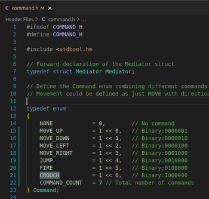
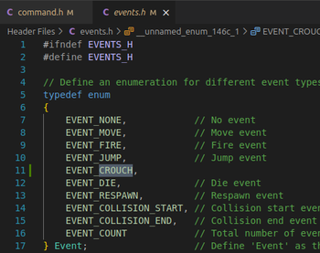
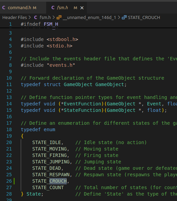
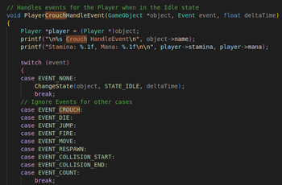
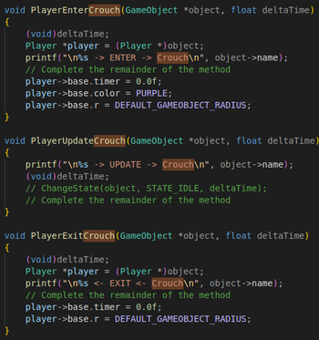
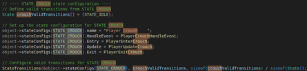
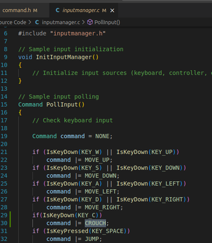

# Game FSM Starter Kit

## Overview

This starter kit provides a basic framework for creating a game using C and a finite state machine (FSM) pattern. The project combines **Finite State Machines (FSM)**, **Command Pattern**, **Collision Detection**, and **Mediator Pattern** and includes essential components such as a `GameObject`, FSM logic for both `Player` and `NPC` entities, and a simple structure for managing events and states. This kit is designed to help you put a FSM in a game focusing on core concepts like event handling, state transitions, and game object management.

The project is organised into several source and header files, along with a `Makefile` to easily compile, build, and run the game.

## Table of Contents

- [Overview](#overview)
- [Quick Start](#quick-start)
- [Architecture](#architecture)
- [Project Structure](#project-structure)
- [Core Systems](#core-systems)
- [Walkthrough](#walkthrough)
- [Tasks](#tasks)
- [Resources](#resources)
- [Support](#support)

## Overview <a name="overview"></a>

This starter kit provides a complete framework for creating games with:

- **Finite State Machine (FSM)**: State-based behavior for game objects (Player, NPC)
- **Command Pattern**: Bitwise command system for input handling
- **Collision Detection**: Circle-based collision using cute_c2 library
- **Mediator Pattern**: Decoupled communication between systems
- **Event System**: Event-driven state transitions
- **Cross-Platform Support**: Works on Windows (MSYS2), Linux (Debian), and MacOS

## Quick Start <a name="quick-start"></a>

### 1. Clone the Repository

```bash
git clone https://MuddyGames@bitbucket.org/MuddyGames/raylib_fsm.git raylib_fsm_project
cd raylib_fsm_project
```

### 2. Install Toolchain (if needed)

```bash
make toolchain
```

### 3. Build and Run

```bash
make build
make run
```

### 4. Clean Build

```bash
make clean
```

## Architecture <a name="architecture"></a>

The system integrates four major design patterns and systems:

### System Flow

[](https://mermaid.live/edit#pako:eNpdk1uP2jAQhf-K5Up9YoGEXCCtVlpCgFWVLiptHxpWlUnGkNaxkePQTRH_vcYJt-Yhysz5zhlHGh9wKjLAAd5Istuir-MVR_p5Sp75rlJoAvs8hfLjWvYeP0G9FkRmvVBwJQVjIF_Rw8MjGrdwTDjZgDTwQuum-9oEjg0ZJqEoCsIzNM7Vn7wEw8Yv36Of3xYIvd-DVB_Q9PlL1NpCY5skMWQ5UaLJPhdzHcSgTWwNE2OILnOiN0grlQtunE31nyUylmkyXcYGamKjPfDz4aeGmCUzUsDL-hekqvlHRmqQvc-LsOVmhpvr4YzlpR6KlnWpoDB0uIX090VpHfNmdlM071LVDNATojljwTuwqEvprTJuFUqpA9atEl6Uk-tWmZwVVyt3adF1Dr1Pm96k3Suz6wlG98r8mjaiFHdwAbIgeab363DiVlhtoYAVDvRnBpRUTK3wih81SiolljVPcaBkBR0sRbXZ4oASVuqq2mVEwSQnek-LS3dH-A8hirNlI0-jWjvwDGQoKq5wYFuugXFwwG84GPRH3YE7dF2rb7uDUd_r4Fp3va5t-47v2JbtOZ4zdI4d_NfE97tD3_eGjuW5jm-7luV0sF5CvYNxc3vMJTr-AwGUB2U)

### Key Components

1. **Finite State Machine (FSM)**

The FSM manages the state transitions of game objects like the Player and NPC. The FSM handles event-driven state transitions and ensures each game object behaves according to its current state.
   
   - Manages object states (Idle, Moving, Firing, Jumping, Dead, Respawn)
   - Event-driven state transitions
   - State-specific entry, update, and exit functions

2. **Command System**
   
   - Bitwise command flags for simultaneous actions
   - Supports command combinations (e.g., MOVE_LEFT | JUMP)
   - Decoupled input from game logic

3. **Collision Detection**
   
   - Circle-based collision using cute_c2
   - Collision manifolds for collision response
   - Collision events (COLLISION_START, COLLISION_END)

4. **Mediator Pattern**
   
   - Coordinates between Input, Command, and GameObject systems
   - Reduces coupling between components

## Project Structure <a name="project-structure"></a>

```
project-root/
├── bin/                # Directory to hold the compiled binaries (output)
├── include/            # Header files for the project
│   ├── collision.h     # Collision system wrapper
│   ├── command.h       # Command structures and functions
│   ├── constants.h     # Shared constants (e.g., sizes, speeds, config values)
│   ├── cute_c2.h       # cute_c2 collision
│   ├── events.h        # Defines event types for the FSM
│   ├── fsm.h           # FSM logic and state management declarations
│   ├── game.h          # Game system interface
│   ├── game_object.h   # Defines the GameObject structure and functions
│   ├── input_manager.h # Input handling system
│   ├── aimanager.h     # AI input handling for NPCs
│   ├── mediator.h      # Mediator pattern interface
│   ├── npc.h           # NPC-specific logic and behaviors
│   └── player.h        # Player-specific logic and behaviors
├── src/ # Source files for the project
│   ├── collision.c     # Collision system wrapper implementation
│   ├── command.c       # Command implementations
│   ├── cute_c2_impl.c  # cute_c2 Makefile helper
│   ├── fsm.c           # FSM logic for handling states and events
│   ├── game.c          # Game system implementation
│   ├── input_manager.c # Input system implementation
│   ├── aimanager.c     # AI decision making
│   ├── main.c          # Entry point, sets up and runs the game
│   ├── mediator.c      # Mediator implementation
│   ├── npc.c           # NPC-specific behaviors
│   └── player.c        # Player-specific behaviors
├── Makefile            # Makefile to build and run the project
└── README.md           # This readme file
```

### Description of Files and Directories

- **`bin/`**: This directory holds the output binary (`game`), which is the compiled executable of the game.
- **`include/`**: Contains all the header files that define the structures, functions, and interfaces for the game components.
- **`src/`**: Contains the source code for the game logic, including the main game loop, FSM implementation, and entity-specific logic (Player and NPC).
- **`Makefile`**: The Makefile defines the build process, compiles the source files, places the resulting binary in the `bin/` directory, and automatically runs the game after a successful build.

## Core Systems <a name="core-systems"></a>

### 1. Finite State Machine (FSM)

The FSM manages object behavior through states and transitions:

**Available States:**

- `STATE_IDLE` - GameObject at rest
- `STATE_MOVING` - GameObject in motion
- `STATE_FIRING` - GameObject attacking
- `STATE_JUMPING` - GameObject jumping
- `STATE_DEAD` - GameObject defeated
- `STATE_RESPAWN` - GameObject respawning

[](https://mermaid.live/edit#pako:eNqdk2tLwzAUhv9KOR-lG70n5oMwbJWK68Y2J2hFwppdYE1Glopz9L_bdrfOYRHzKe95n_MmB5ItTETCgMBaUcX8BZ1JmrY-rJhrxXq9etNarRttOOqMgvfQfwx29ZOu2d3eOIzuNaIF4yAalfKM3tvncUc66kXN9F04qKcX8ozf239M_3Hzh6duvx5e6jp-8P-X7gcd_8j6YfOYTfDFjE3w5Z2b6Mr7ZbxBMOx3nqOYlw2gQ8pkShdJ8Wa2ZSUGNWcpi4EU24RNabZUMcQ8L1CaKTHc8AkQJTOmgxTZbA5kSpfrQmWr5PTmjtUV5S9CpIeWmSyP2rcznjB5KzKugJgurmAgW_gEYtttD7nINZBtOZaJkavDpqRQ28TX2HAMhEwHO06uw1eVb7QdhD3DdF3PNC2MLNvTgSULJWR39yeqr5F_A_5z4Kw)

**State Configuration:**

Each state has:

- **HandleEvent**: Processes events and triggers state transitions
- **Entry**: Called once when entering the state
- **Update**: Called every frame while in the state
- **Exit**: Called once when leaving the state

**Example State Setup:**

```c
// Define valid transitions from IDLE
State idleValidTransitions[] = {STATE_MOVING, STATE_FIRING, STATE_JUMPING, STATE_DEAD};

// Configure IDLE state
object->stateConfigs[STATE_IDLE].name = "Player_Idle";
object->stateConfigs[STATE_IDLE].HandleEvent = PlayerIdleHandleEvent;
object->stateConfigs[STATE_IDLE].Entry = PlayerEnterIdle;
object->stateConfigs[STATE_IDLE].Update = PlayerUpdateIdle;
object->stateConfigs[STATE_IDLE].Exit = PlayerExitIdle;

// Set valid transitions
StateTransitions(&object->stateConfigs[STATE_IDLE], idleValidTransitions, 
                 sizeof(idleValidTransitions) / sizeof(State));
```

**FSM State Diagram:**

[](https://mermaid.live/edit#pako:eNqNk1FrwjAUhf9KuE_bqNIW22oeBrJ2wzGraOdg6xjBRg3YVGK66cT_vtTq7Cy0y1NO8p17Twh3B9MkooBhLYmkLiNzQeLGpxlypNbbzTtqNG7ROOgG3kfPffLy87MuXPcHk57_gJE38fwgU1XwfW9UgJWqgh-f-8MCnckK2vW67gl1e8e6RT4PevGwk8Mf-F4lXJ28hNdkL_G16fP-pfQBi6lA3mbFBF1X8qd_-uNAV19MLhDjq1ReV9prAx5f_P-EZUNtjwwo8CNvPOy--Bh1U5mgQBC-ZpIlvGg5MqVYFxbQQMWMCYvUUOyyAiHIBY1pCFhtIzoj6VKGEPK9Qokyj7d8CliKlGogknS-ADwjy7VS6So6D9Xv6Yrw1ySJT5a5yFod7ZRHVNwlKZeALfPAAt7BBrBtN9uObRm6beqG4RgdDbaATaup222r1TZ10zJatrXX4PtQXFe4Y7dbRqejm4bT6jga0IjJRPTzgT_M_f4Hvy8ksA)

### 2. Event System

Defines different types of events that can trigger state changes in the game. Events trigger state transitions:

```c
typedef enum
{
    EVENT_NONE,             // No action
    EVENT_MOVE,             // Movement input
    EVENT_FIRE,             // Attack action
    EVENT_JUMP,             // Jump action
    EVENT_DIE,              // Death condition
    EVENT_RESPAWN,          // Respawn trigger
    EVENT_COLLISION_START,  // Collision begins
    EVENT_COLLISION_END,    // Collision ends
    EVENT_COUNT             // Total event count
} Event;
```

### 3. Command Pattern

The command system uses bitwise flags for simultaneous actions:

**Command Flags:**

```c
typedef enum
{
    NONE         = 0,        // No command
    MOVE_UP      = 1 << 0,   // Binary: 000001
    MOVE_DOWN    = 1 << 1,   // Binary: 000010
    MOVE_LEFT    = 1 << 2,   // Binary: 000100
    MOVE_RIGHT   = 1 << 3,   // Binary: 001000
    JUMP         = 1 << 4,   // Binary: 010000
    FIRE         = 1 << 5,   // Binary: 100000
    COMMAND_COUNT = 6
} Command;
```

**Command Combinations:**

```c
// Move left AND jump simultaneously
Command combo = MOVE_LEFT | JUMP;
// Binary: 000100 | 010000 = 010100

// Check if MOVE_LEFT is active
if (IsCommandActive(command, MOVE_LEFT)) {
    // Execute move left
}

// Check if JUMP is active
if (IsCommandActive(command, JUMP)) {
    // Execute jump
}
```

**Command Flow:**

[](https://mermaid.live/edit#pako:eNpVkm9r2zAQxr-KUKFv6mZW_KeOMwqJk42VhYaWdjC7DMU-Jd4sychSaRby3acoTpfei0O65_ndCXQ7XMoKcIrXirYb9P2hEMjGJF82dAsKfROt0Z9X6tPtj6vHlpaAWgVdB9ULur6-RdN8KZvGmdBF6I9tImNnfwBtlOhQJjmnono59p06Ksv7KvrS0HXn_Iv75_mvpyW6fAWlx-juabF0dZ_4vk96PHP4LJ-_QWk0nLp8nJxtoPyDaKnrV0CrWnc9PHPwPP9KOdyvfkOp0cSapOgfIK39Ct0Z3vbAMXd62wCaIFY3TXoBhEWMnSvTXmGMhUDOlexdOVDnyux_N_aRmZ-Y6KBhD3NQnNaV_aHdwVdgvQEOBU7tsQJGTaMLXIi9tVKj5eNWlDjVyoCHlTTrDU4ZbTp7M21FNcxqan-av1dbKn5KyU_IWh1G9TiIClQmjdA4jWLnxekOv-E0iQbRcJTEJIx8MooC4uEtTsNgQOKb-MbWkoD4UbT38F_X3B8kJIjJMAlGw9BGHHgYqlpLtThun1vC_T_t4cec)

### 4. Collision Detection

The collision system uses cute_c2 for circle-based collision:

**Collision Flow:**

```c
// Update colliders
player->base.collider.p.x = player->base.x;
player->base.collider.p.y = player->base.y;
player->base.collider.r = player->base.r;

// Check collision
bool isColliding = CheckCollision(&player->base, &npc->base);

// Handle collision states
if (isColliding && !player->base.isColliding) {
    // ENTER: First frame of collision
    HandleEvent(&player->base, EVENT_COLLISION_START, deltaTime);
    CollisionEntry(&player->base, &npc->base);
    HandleCollision(&player->base, &npc->base);
}
else if (!isColliding && player->base.isColliding) {
    // EXIT: First frame after collision ends
    HandleEvent(&player->base, EVENT_COLLISION_END, deltaTime);
    CollisionExit(&player->base, &npc->base);
}
else if (isColliding && player->base.isColliding) {
    // ONGOING: Continue collision response
    HandleCollision(&player->base, &npc->base);
}
```

**Collision Features:**

- Circle-to-circle collision detection
- Collision manifolds for separation
- Collision events integrated with FSM
- Pushback/separation response
- Health damage on collision

### 5. GameObject

**Base GameObject Structure:**

A `GameObject` represents an entity in the game. It has:

- A name
- A health value
- A state (current and previous states)

Functions to initialise and delete `GameObject` instances are included, along with logic to handle state transitions.

Class diagram

[](https://mermaid.live/edit#pako:eNqtVe1u2jAUfRXLUiW6pqihUEJUIVUQOqbxoUI7aWOqXHJJUiU2cpy2rOLdZydpMRjUbVp-JPa5x_Y5vtfxK54zH7CL5zFJ025EAk6SGUXyOTpCHs2StOjlceQ9ARXotYDUc3kJktNub5AT784bTu-Ho6FngIPRnQn2-jcm-OV2MDbAbt8k3niT8dW3oYF3RrfDaYGuZ1T3MBFEwAceJtOrqXff7371DFB66A-vDVi62AcrH_vwrnfVNcB9mmUWrkkCo4dHmAsLDccdCxHqo3FMVsALS7CVow1dN3kyETyiAaIyuoWqzVhyeIpYluY9IzrPOJdp3xvsMLqIgh8_UbrppRopkuUSAolFqIFPLPJRn0ZiI7WidB3vcroQgwCNZTA-y72IIS_LSlGcoN4674GxGHUI9agAnouuFL4oPOcNkxwSGsBH1Hz926Uv4YJ6fLjcio35g3zkHnoZnYuIUd3d7sa_c6QtvjoYLfQdHvwSGTPLZFJ4KdK9m8pNoMOyN1E7hmWJbhlV40gQcEhTuaQWUERVBfK7P_1lsDcZVLSiZg-Pf1kGOwLLo6NrXMSMCFXDSUSJgSdkCyzHK3VF87D6Iv7_DMi_wQ3EROUuDaNlmR61kaenbf3kuyiiIfBIlJRS8wcsLTTD9gznfNmqVj_Jjl7JLgpJqqkaczaXCUa9mD0bc1Wr7fLmcOWvJidCupdVnDYXZXnZavZUcEt4JqfQdw0J9jY30g5M6ftfhmMLJ8ATEvnyesyLZYZFCPK4Ylc2fViQLBYzPKNrSSWZYJMVnWNX8AwszFkWhNhdkDiVvcJPeb2-o0tCvzOWvA0JuFqqHA7UB54fMuzWGrWcjN1X_IJdu1av1pp2_cw5c-yzRv2iZeEVds-bVcexnXrz3LEbLdtZW_hXPrtdtR2n0Wi2WheS3mzaTQuDHwnGB-Xdrz7r39PqaTE)


```c
typedef struct GameObject
{
    const char *name;        // Object identifier
    
    // Transform
    float x, y;              // Position
    int r;                   // Radius
    Vector2 direction;       // Movement direction
    Vector2 inputAxis;       // Input direction
    
    // Collision
    c2Circle collider;       // Circle collider
    c2Manifold manifold;     // Collision manifold
    bool isColliding;        // Collision state
    
    // Visual
    Color color;             // Render color
    
    // FSM
    State previousState;     // Previous state
    State currentState;      // Current state
    StateConfig *stateConfigs; // State configurations
    
    // Gameplay
    int health;              // Health points
    float timer;             // General-purpose timer
} GameObject;
```

Player and NPC Entities (`player.h`, `npc.h`, `player.c`, `npc.c`)**

These files define specific behavior for `Player` and `NPC` entities:

- The `Player` has attributes like stamina and mana, and behaviors like attacking and shielding.
- The `NPC` has aggression and can perform similar actions like the player.

Both entities use the same FSM system, but each has unique logic for how to handle events in various states.

### 6. Input System

**Keyboard Mapping:**
- WASD / Arrow Keys: Movement
- Space: Jump
- Left Mouse Button: Fire

**Input Processing:**

```c
Command PollInput() {
    Command command = NONE;
    
    if (IsKeyDown(KEY_W) || IsKeyDown(KEY_UP))
        command |= MOVE_UP;
    if (IsKeyDown(KEY_S) || IsKeyDown(KEY_DOWN))
        command |= MOVE_DOWN;
    if (IsKeyDown(KEY_A) || IsKeyDown(KEY_LEFT))
        command |= MOVE_LEFT;
    if (IsKeyDown(KEY_D) || IsKeyDown(KEY_RIGHT))
        command |= MOVE_RIGHT;
    if (IsKeyPressed(KEY_SPACE))
        command |= JUMP;
    if (IsKeyDown(KEY_LEFT_SHIFT))
        command |= FIRE;
    
    return command;
}
```

## Walkthrough adding _Crouch_ to FSM <a name="walkthrough"></a>

Follow steps below to add a new **_STATE_CROUCH_** into **Finite State Machine**.

### 1️⃣ Add _CROUCH_ to _Command_
Update **`command.h`** to include the new **_CROUCH_** command.



### 2️⃣ Add _EVENT_CROUCH_ to _Event_
Update **`event.h`** to define new event **_EVENT_CROUCH_** associated with crouching.



### 3️⃣ Add _STATE_CROUCH_ to _FSM_
Insert the **_STATE_CROUCH_** enum entry into **`fsm.h`**.



### 4️⃣ Implement _Crouch_ Handlers

In **`player.h`** and **`player.c`**, add the following functions (these are function pointers in **_StateConfig_**):

- `HandleCrouchEvent`
- `PlayerEnterCrouch`
- `PlayerUpdateCrouch`
- `PlayerExitCrouch`





### 5️⃣ Add _State_ Configurations in _Player_

Register **_STATE_CROUCH_** protocol callbacks for **_StateConfig_** in **`player.c`**.



### 6️⃣ Define How to _Enter()_ / _Exit()_ **_STATE_CROUCH_**

[](https://mermaid.live/edit#pako:eNp1UVtrwjAU_ivl7EEYtTRNrW0cwqgFha3CdHvYOkZmjhdmE0lTmRP_--JlUwYLBJLvfJecnC1MlEBgUBlusLfgM83L5joopGPXy_Wr02x2ndH4dpy9DXp3WSGPlTNyQUgfho9pnzmNtOF84MZZaawqFDfvutvnUixxYHe2RmmuQr_jeVch6eyL2VOWj0_qS_sj8ucF1j5Xl_aNs3-qVT2Z_5uQD3PbALhQoi75Qti2t_u8AswcSyyA2aPAKa-XpoBC7iyV10aNNnICzOgaXbAJszmwKV9W9lavxPnbftEVl89KlT-Smd5HneQoBepU1dIAozQ6kIFt4RNYkCSeT0jcJpS248S3xQ0wCyZRlNAw8EPik1a0c-Hr4O57rYC2w5iGhIZxHNGWCygWRun740wPo919A_5pkcg)

### 7️⃣ Update _Input_Manager_

Ensure Input Manager processes **"C" key** triggering Crouch _Command_ / _Event_.




## Tasks <a name="tasks"></a>

### Task 1: Add a New State

1. Add state to `events.h`:
```c
STATE_DASHING,  // Add before STATE_COUNT
```

2. Implement state functions in `player.c`:
```c
void PlayerDashingHandleEvent(GameObject *object, Event event, float deltaTime);
void PlayerEnterDashing(GameObject *object, float deltaTime);
void PlayerUpdateDashing(GameObject *object, float deltaTime);
void PlayerExitDashing(GameObject *object, float deltaTime);
```
Here are the Idle Methods which are function pointers to StateConfig
```c
// Define a configuration structure for each state of the GameObject
typedef struct StateConfig
{
    const char *name;          // The name of the state (e.g., "Idle", "Moving")
    EventFunction HandleEvent; // Pointer to the function that handles events in this state
    StateFunction Entry;       // Pointer to the function that is called when entering this state
    StateFunction Update;      // Pointer to the function that is called to update the state
    StateFunction Exit;        // Pointer to the function that is called when exiting this state
    State *nextStates;         // Array of possible next states (state transitions)
    int nextStatesCount;       // Number of possible next states
} StateConfig;                 // Define 'StateConfig' as a structure that holds all state-related configurations
```
Idle Player function pointers
```c
// Handles events specific to the Player_Idle state, such as reacting to input
// or conditions that could trigger a state transition (e.g., movement or firing).
void PlayerIdleHandleEvent(Player* object, Event event);

// Executed when the player enters the idle state. This function can be used to
// reset animations, stop movement, or prepare the player for an idle stance.
void PlayerEnterIdle(Player* object);

// Called on every update tick while the player remains in the idle state.
// It may handle idle animations or monitor for any transitions to other states.
void PlayerUpdateIdle(Player* object);

// Executed when the player exits the idle state, allowing cleanup tasks
// or transitions to be set up for the next state (e.g., resetting certain flags).
void PlayerExitIdle(Player* object);
```
Configurered using
```c

object->stateConfigs = (StateConfig *)malloc(sizeof(StateConfig) * STATE_COUNT);

// STATE_IDLE state configuration
State idleValidTransitions[] = {STATE_MOVING, STATE_DEAD};

object->stateConfigs[STATE_IDLE].name = "Player_Idle";
object->stateConfigs[STATE_IDLE].HandleEvent = PlayerIdleHandleEvent;
object->stateConfigs[STATE_IDLE].Entry = PlayerEnterIdle;
object->stateConfigs[STATE_IDLE].Update = PlayerUpdateIdle;
object->stateConfigs[STATE_IDLE].Exit = PlayerExitIdle;
```

3. Configure state in `InitPlayerFSM()`:
```c
State dashingValidTransitions[] = {STATE_IDLE, STATE_DEAD};
object->stateConfigs[STATE_DASHING].name = "Player_Dashing";
// ... set function pointers
StateTransitions(&object->stateConfigs[STATE_DASHING], dashingValidTransitions, 2);
```

### Task 2: Add a New Command (DODGE)

1. Add command flag in `command.h`:
```c
DODGE = 1 << 6,  // Binary: 1000000
```

2. Add input binding in `input_manager.c`:
```c
if (IsKeyPressed(KEY_LEFT_CONTROL))
    command |= DODGE;
```

3. Handle command in `command.c`:
```c
if (IsCommandActive(command, DODGE))
    HandleEvent(mediator->object, EVENT_DODGE, deltaTime);
```

4. Add EVENT_DODGE to `events.h` and handle in state functions

### Task 3: Modify Collision Response

Experiment with different collision behaviors:

- Change damage values in `collision.c`
- Modify pushback distance
- Add different collision types (friendly, enemy, neutral)
- Implement collision-based state transitions

### Task 4: Create NPC AI Patterns

Enhance `aimanager.c` with:

- Patrol behavior
- Chase player when in range
- Flee when health is low
- Random movement patterns

### Task 5: Implement Command Combos

Create special moves by detecting command sequences:
```c
// Double-tap detection
if (IsCommandActive(command, MOVE_LEFT)) {
    if (lastCommandTime - currentTime < DOUBLE_TAP_WINDOW) {
        // Trigger dash left
    }
}
```

### Task 6: Add Visual Effects

Enhance visual feedback:

- Trail effects during movement
- Impact effects on collision
- State-based animations (breathing in idle)
- Health bar improvements

## Usage Examples

### Basic Game Loop

```c
int main(void) {
    InitWindow(SCREEN_WIDTH, SCREEN_HEIGHT, "Game Starter Kit");
    SetTargetFPS(60);
    
    GameData *data = (GameData *)malloc(sizeof(GameData));
    InitGame(data);
    
    while (!WindowShouldClose()) {
        float deltaTime = GetFrameTime();
        
        UpdateGame(data, deltaTime);
        
        BeginDrawing();
        ClearBackground(RAYWHITE);
        DrawGame(data);
        EndDrawing();
    }
    
    CloseGame(data);
    CloseWindow();
    
    return 0;
}
```

### Adding Custom Player Behavior

```c
void PlayerCustomHandleEvent(GameObject *object, Event event, float deltaTime) {
    switch (event) {
        case EVENT_CUSTOM:
            ChangeState(object, STATE_CUSTOM, deltaTime);
            break;
        // Handle other events...
    }
}

void PlayerUpdateCustom(GameObject *object, float deltaTime) {
    Player *player = (Player *)object;
    
    // Custom update logic
    player->base.timer += deltaTime;
    
    if (player->base.timer >= CUSTOM_DURATION) {
        ChangeState(object, STATE_IDLE, deltaTime);
    }
}
```

## Resources and how to Modify or Extend  <a name="resources"></a>

You can modify or extend this starter kit in various ways:

- **Add New States**: Add new states to the FSM by extending the `State` enum and updating the state transition logic in `fsm.c`.
- **Create New Events**: Define new events in `events.h` and add corresponding behavior in the FSM.
- **Create New Behaviors**: Extend the `Player` or `NPC` behavior by adding more specific functions in `player.c` or `npc.c`.

Feel free to extend this framework to create a more complex game.

## Support  <a name="support"></a>
### Who do I talk to? ###

* muddygames